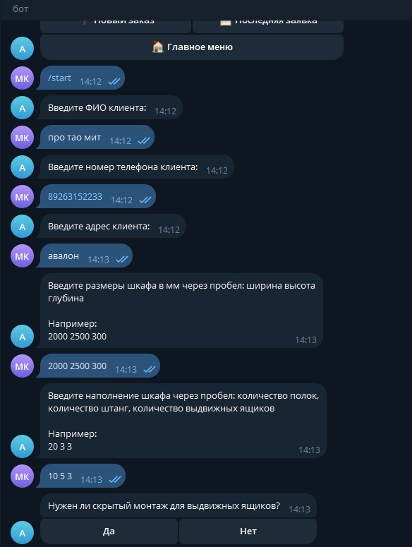
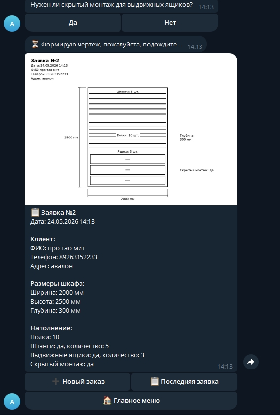

# Telegram-бот для оформления заявок на шкафы
Демонстрационный проект Telegram-бота для менеджеров мебельного производства.

Бот помогает быстро оформить заявку на изготовление шкафа или стеллажа, собрать данные клиента, размеры изделия, наполнение шкафа и автоматически сформировать технический чертёж.
## Демо

Telegram-бот: [открыть демо-бота](https://t.me/aitron_video1_bot)

Важно: бот отвечает только когда запущена демонстрационная среда GitHub Codespaces.

## Скриншоты

### Запуск бота

### Готовая заявка

## Что умеет бот

- принимает заявку через Telegram;
- пошагово запрашивает данные клиента;
- собирает размеры шкафа: ширину, высоту и глубину;
- собирает наполнение: количество полок, штанг и выдвижных ящиков;
- уточняет наличие скрытого монтажа;
- формирует итоговую заявку;
- генерирует черно-белый технический чертёж;
- отправляет менеджеру изображение чертежа и текст заявки.

## Сценарий работы

1. Менеджер запускает бота командой `/start`.
2. Нажимает кнопку «Новый заказ».
3. Вводит ФИО клиента.
4. Вводит телефон.
5. Вводит адрес.
6. Вводит размеры одной строкой: ширина, высота, глубина.
7. Вводит наполнение одной строкой: полки, штанги, ящики.
8. Если есть ящики, бот спрашивает про скрытый монтаж.
9. Бот показывает итог заявки.
10. После подтверждения бот формирует технический чертёж.

## Пример заявки

Заявка №8  
Дата: 24.05.2026 14:00

Клиент:  
ФИО: Тестовый клиент  
Телефон: 89999999999  
Адрес: Москва

Размеры шкафа:  
Ширина: 2000 мм  
Высота: 2500 мм  
Глубина: 300 мм

Наполнение:  
Полки: 10  
Штанги: да, количество: 3  
Выдвижные ящики: да, количество: 3  
Скрытый монтаж: да

## Техническая часть

Проект реализован на Python.

Используется:
- Python;
- aiogram;
- SQLite;
- Pillow;
- dotenv;
- Telegram Bot API.

В демонстрационной версии чертёж генерируется локально через Pillow, без внешнего API генерации изображений.

## Статус проекта

Проект находится в MVP-версии и подготовлен для демонстрации логики работы.

Возможные следующие доработки:
- отправка заявки в производственный чат;
- статусы заявок;
- поиск по номеру заявки;
- подключение CRM или Google Sheets;
- деплой на VPS для работы 24/7.
