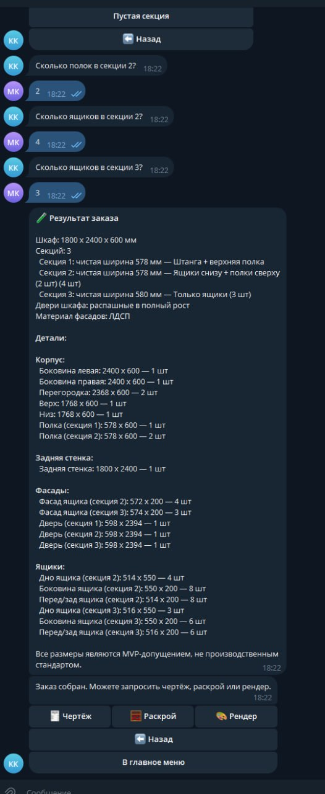
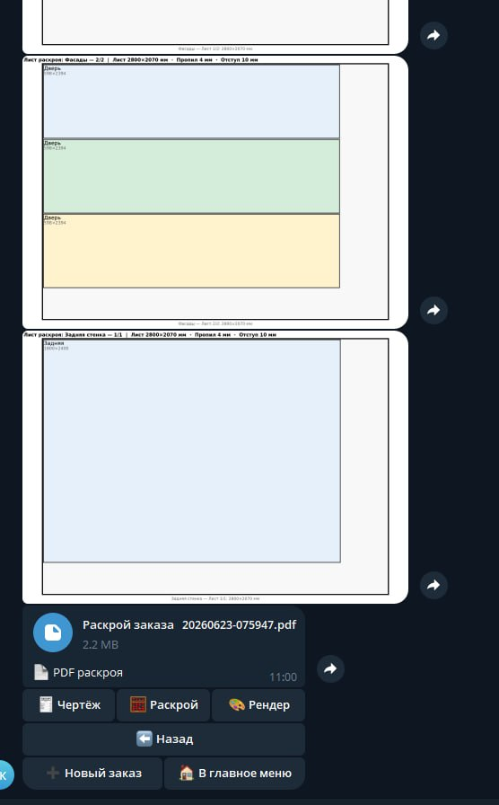
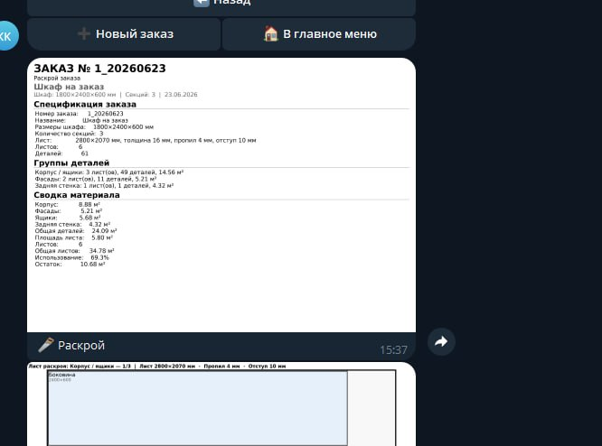
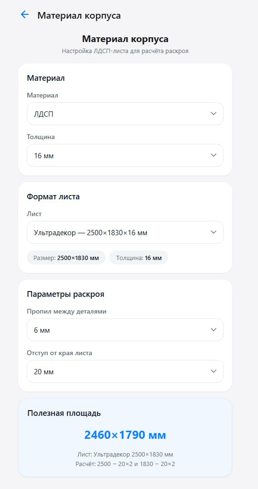
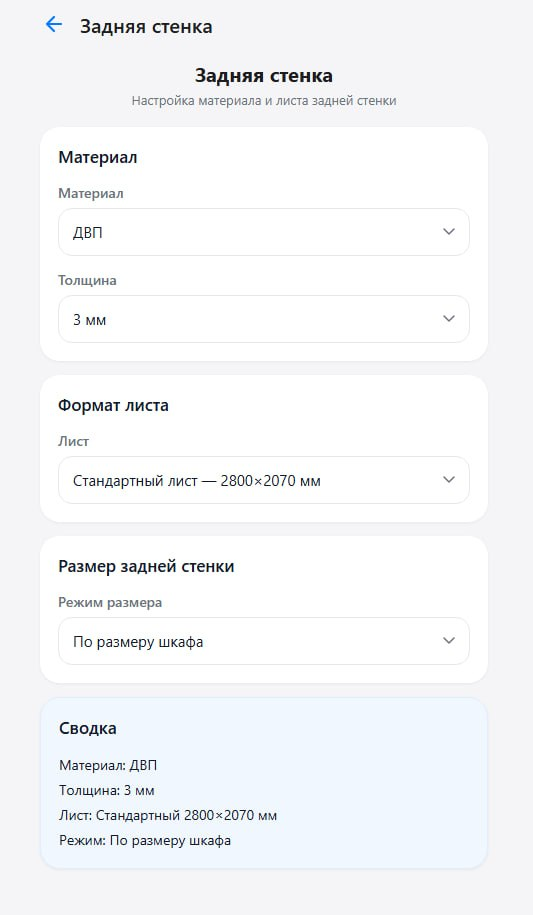
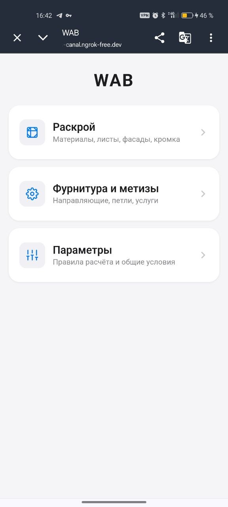

# Wardrobe Bot

## AI платформа автоматизации мебельного производства

Wardrobe Bot это цифровая система автоматизации подготовки мебельных
изделий от идеи до производства.

Платформа объединяет Telegram конструктор, WebApp конфигуратор WAB,
подготовку производственной документации и AI визуализацию будущего
изделия.

## О проекте

Wardrobe Bot помогает превратить описание будущего шкафа в
структурированный производственный проект.

Система позволяет:

• Формировать параметры изделия.

• Создавать спецификацию шкафа.

• Подготавливать техническую документацию.

• Создавать карту раскроя.

• Получать визуальное представление будущего изделия.

# Основные возможности

## Telegram конструктор

Telegram бот используется для пошагового формирования изделия.

Через него задаются:

• Размеры шкафа.

• Количество секций.

• Внутреннее наполнение.

• Фасады.

• Материалы.

• Фурнитура.

• Крепёж.

## WAB WebApp конфигуратор

WebApp конфигуратор используется для расширенной работы с параметрами
изделия.

Возможности:

• Настройка конфигурации шкафа.

• Управление параметрами заказа.

• Подготовка данных для технических модулей.

• Контроль характеристик будущего изделия.

## Производственная документация

Система формирует:

• Технический чертёж.

• Детали изделия.

• Карту раскроя.

• PDF документацию.

• Структурированную спецификацию заказа.

## AI визуализация шкафа

AI визуализация позволяет получить изображение будущего изделия до
начала производства.

Используемые инструменты:

• Gemini для AI генерации и работы с визуальными задачами.

• ProxyAPI для подключения AI сервисов через единый интерфейс.

• Текстовые команды для изменения результата.

• Голосовые команды для корректировки описания.

# Демонстрация работы

## Telegram Bot

## Производственная документация

## WAB WebApp конфигуратор

## Видео демонстрация

[Wardrobe Bot Demo](wardrobe_bot_demo_small.mp4)

# Технологии

Проект разработан с использованием:

• Python.

• Telegram Bot API.

• WebApp технологий.

• HTML и CSS.

• JavaScript.

• SQLite.

• PDF генерации.

• Gemini AI.

• ProxyAPI.

• Git и GitHub.

# Среда разработки

При создании проекта использовались:

• Python окружение разработки.

• Модульная структура проекта.

• Разделение логики бота, WebApp и производственных модулей.

• Git система контроля версий.

# Развитие проекта

Основные направления развития:

• Расширение библиотеки мебельных изделий.

• Улучшение AI визуализации.

• Развитие автоматической подготовки документации.

• Интеграция с производственными системами.

• Создание полноценной цифровой платформы взаимодействия клиента,
конструктора и производства.
